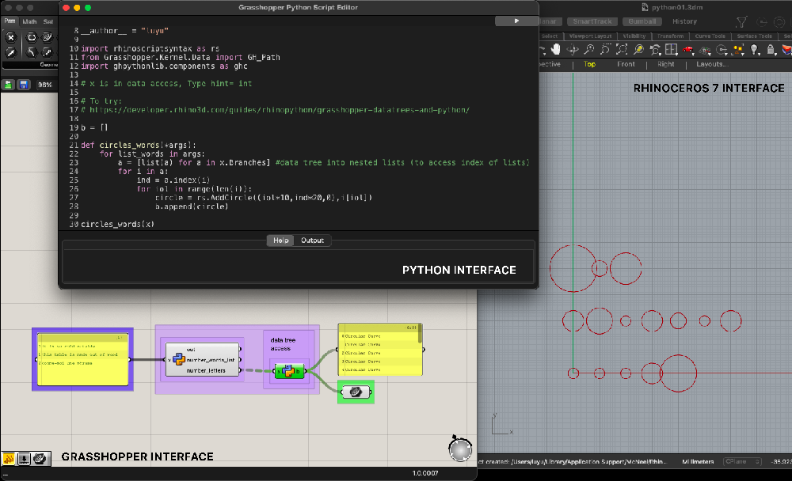
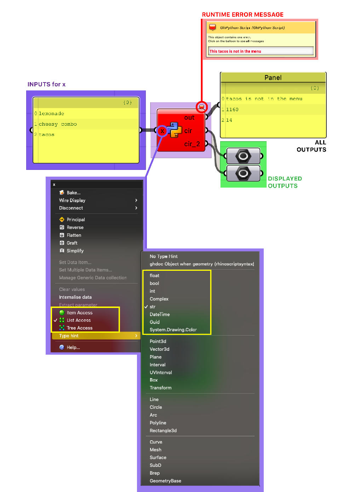
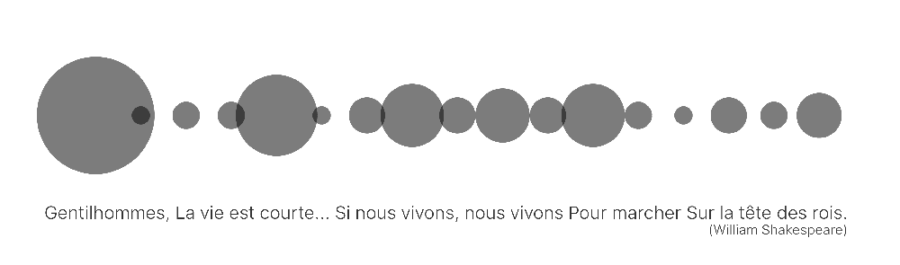
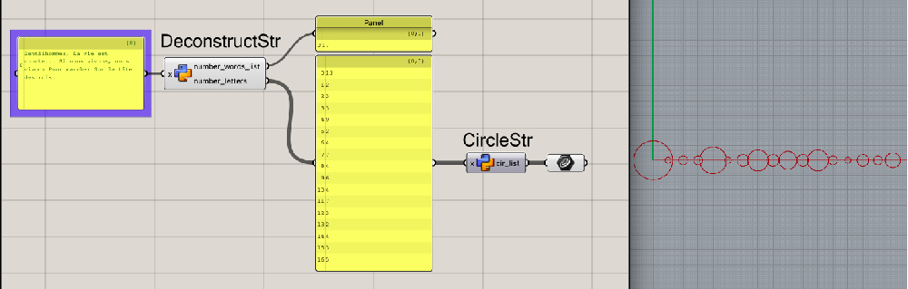

# Exploring Python with Grasshopper x Rhinoceros 7

This repository contains the following codes: 
- **Python_folder**
	- Calories counter
	- Order counter (price + calories + exceptions)
- **Grasshopper_python**: adapted code for Grasshopper
	- Calories counter in circle
	- Order counter in circles (one for calories, one for price) + RunTime Error Message
	- Wheighty Words Component 1
	- Wheighty Words Component 2

It contains the following grasshopper components: DeconstructStr (Component #1) and CircleStr (Component #2)

Find more informations below on how it works: 
1. Quick Sum-up | Interfaces - Rhinoceros 7 x Grasshopper x Python
2. Calories Counter | First steps in Python for Grasshopper 
3. Wheighty Words | Personal Project
<br>
<br>

## Quick Sum-up | Interfaces - Rhinoceros 7 x Grasshopper x Python



### 1/ Using [Rhinoceros 7 software](https://www.rhino3d.com/en/)
&rarr; Rhinoceros 7 is a 3D modeling tool used in architecture and parametric design. It is not open source but has a 3 months free trial and discount for students.


### 2/ Using Grasshopper in Rhinoceros 7
&rarr; Grasshopper is an open source plug-in in Rhinoceros to generate parametric modeling. The created 3D models can be easily adapted and changed to the needs without having to rebuild the model from scratch.

When working in grasshopper, we usually build a "block algorithm" to get the wanted model (2D or 3D shapes). Grasshopper is the interface where we write the construction plan and the actual model appears in the Rhinoceros interface (both are linked). This is important to understand that you can build a model in Rhinoceros using the Rhinoceros commands OR/AND in Grasshopper using the Grasshopper commands (also called components).

### 3/ Using the GH python Script component from Grasshopper
&rarr; In order to be able to use Python language in Grasshopper and Rhino, we use the **GH python Script** component. This component takes inputs (as many as we want) and generates outputs.

#### Syntax characteristics
While using the Python language you can use the existing commands from Rhinoceros 7 and from Grasshopper in your code. This is following the OOP logic as described below (picture [©DevangChauhan](https://discourse.ladybug.tools/t/learning-python-for-rhino-grasshopper/2643/5)):

[](https://discourse.ladybug.tools/t/learning-python-for-rhino-grasshopper/2643/5)
*"In the image above, Geometry is a namespace that hosts classes such as Curve class, Solid Class, and many more."* 
&rarr; For each class, you will find attributes (property), Constructor methods (How to build it) and Methods (how to change it).
<details>
<summary>IMPORTING SPECIFIC SYNTAXES</summary>

- import System.Drawing as sd

- import ghpythonlib.components as ghc

- import rhinoscriptsyntax as rs
</details>
<br>
<br>
<br>

## Calories Counter | Exploring Python in Grasshopper

### 1/ Basics Elements of the GH Python Script


- **Inputs for x**
The nature of the inputs can (and should) be precised: int, str...
If data is given from a panel, we need to precise *how we access* this data whether it is list access, data tree access or item access. This is important information to check because it will impact the code afterwards! (And usually where the problem is coming from)
- **Outputs**
&rarr; By default you have a **out** output that you can connect to a panel to have access to the results of your code running.
&rarr; Then, you can add personalised outputs. For example if one of the outcomes of your code is a circle you can append this shape to an output named cir1 ( `cir1.append(circle)` to be added in your code).
- **How to add a RunTime Error Message Display**
````
import rhinoscriptsyntax as rs
[code]
ghenv.Component.AddRuntimeMessage(ghenv.Component.RuntimeMessageLevel.Error,('This ' + meal + ' is not in the menu'))
````
<br>
<br>

## Wheighty Words | Personal Project



 

***
<details>
<summary> RESOURCES </summary>

- [Guides for developers in Rhino](https://developer.rhino3d.com/guides/)
- [Digital FUTURES conferences on architecture with Rhino and Grasshopper](https://www.youtube.com/@DigitalFUTURESworld)
- [Guides for developpers in Grasshopper](https://developer.rhino3d.com/api/grasshopper/html/723c01da-9986-4db2-8f53-6f3a7494df75.htm)
- More plug-in for Grasshopper in [Food4Rhino](https://www.food4rhino.com/en?lang=en)
- [How to change icon of python component](https://discourse.mcneel.com/t/how-to-change-the-icon-of-grasshopper-python/157528)
- From VisualCode Studio to Grasshopper [Tutorial](https://www.youtube.com/watch?v=DmvTsaV5JwU)
</details>
<br>